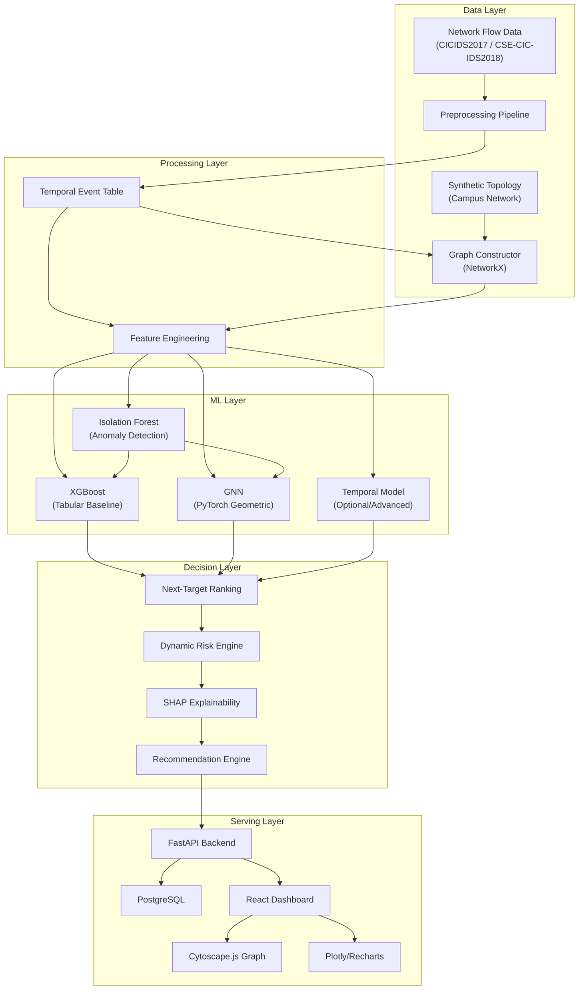

# AI Cyber Attack Prediction Engine — Complete Project Blueprint

## 1. COMPLETE PROJECT SUMMARY

### Problem
Traditional cybersecurity tools (IDS, firewalls, antivirus) are **reactive** — they detect attacks *after* they happen. They answer "what happened?" but not "what will happen next?" or "what should we protect first?" In a campus/enterprise network with hundreds of devices, a security team cannot respond to every alert equally. They need **proactive, prioritized, explainable predictions** of where an attack will propagate next.

### Objective
Build an **AI-powered cyber threat propagation and risk prioritization engine** that:
1. Ingests network flow/log data
2. Reconstructs temporal interaction sequences
3. Represents the network as a dynamic graph
4. Predicts which device is the **next likely attack target**
5. Calculates a **dynamic risk score** combining attack probability + asset criticality
6. Explains *why* a device was flagged
7. Recommends defensive actions
8. Presents everything in a real-time dashboard

### Research Gap
Most existing IDS/ML work focuses on **binary classification** (attack vs. benign) on individual flows. Very little work combines:
- **Temporal attack sequence reconstruction** (who attacked whom, in what order)
- **Graph topology awareness** (network structure matters for propagation)
- **Risk-aware prioritization** (attack probability ≠ protection priority)
- **Explainable next-target ranking** (why this device, not just "it's an attack")

This project bridges that gap by framing cybersecurity as a **temporal, graph-aware, risk-ranked prediction problem** with explainability.

### Use Case
A **simulated university/campus network** with VLANs (Student, Faculty, Admin), servers (File, Database), and a realistic attack scenario:
1. A student PC gets compromised
2. The attacker pivots through the network
3. Our engine predicts the file server is the next target (before it happens)
4. It explains why and recommends isolation/monitoring

### System Workflow (One Sentence)
`Network Data → Preprocessing → Temporal Events → Graph Construction → Feature Engineering → ML Prediction → Risk Scoring → Explanation → Recommendations → Dashboard`

---

## 2. SYSTEM ARCHITECTURE



### Architecture Principles
- **Layered**: Data → Processing → ML → Decision → Serving
- **Staged**: Each ML model builds on the previous (no jumping to GNN before XGBoost works)
- **Modular**: Each component is independently testable
- **Reproducible**: Fixed seeds, versioned data, logged experiments

---

## 3. END-TO-END DATA FLOW

```
┌─────────────────────────────────────────────────────────────────────┐
│ STEP 1: RAW DATA INGESTION                                         │
│ • Load CICIDS2017 CSV files                                        │
│ • Load synthetic campus topology (JSON/CSV)                        │
│ • Schema: timestamp, src_ip, dst_ip, src_port, dst_port,          │
│   protocol, packets, bytes, duration, label                        │
└──────────────────────────┬──────────────────────────────────────────┘
                           ▼
┌─────────────────────────────────────────────────────────────────────┐
│ STEP 2: PREPROCESSING                                               │
│ • Clean: dedup, fix types, handle NaN/Inf, normalize col names     │
│ • Encode: categorical → numeric (protocol, label)                  │
│ • Scale: StandardScaler on numeric features                        │
│ • Sort by timestamp                                                │
│ • Map IPs → stable device IDs (e.g., PC-17, SERVER-04)            │
└──────────────────────────┬──────────────────────────────────────────┘
                           ▼
┌─────────────────────────────────────────────────────────────────────┐
│ STEP 3: TEMPORAL EVENT TABLE                                        │
│ • Each row = one network interaction at a point in time            │
│ • Columns: timestamp, src_id, dst_id, protocol, packets, bytes,   │
│   duration, attack_label, time_window_id                           │
│ • Time windows: 5-minute non-overlapping bins                      │
└──────────────────────────┬──────────────────────────────────────────┘
                           ▼
┌─────────────────────────────────────────────────────────────────────┐
│ STEP 4: ATTACK SEQUENCE EXTRACTION                                  │
│ • Filter attack-labeled flows                                      │
│ • Chain: if A→B at t1, B→C at t2 (t2>t1), then sequence A→B→C    │
│ • Store as ordered propagation chains                              │
│ • This is the raw material for "next target" labels               │
└──────────────────────────┬──────────────────────────────────────────┘
                           ▼
┌─────────────────────────────────────────────────────────────────────┐
│ STEP 5: TARGET LABEL GENERATION                                     │
│ • For each time window T:                                          │
│   - Input features: all events in windows [T-k, T]                │
│   - Target: which device(s) become attack destinations in [T+1]   │
│ • Prediction horizon: start with 15 minutes                       │
│ • Strict temporal split: no future leakage                        │
└──────────────────────────┬──────────────────────────────────────────┘
                           ▼
┌─────────────────────────────────────────────────────────────────────┐
│ STEP 6: GRAPH CONSTRUCTION                                          │
│ • Per time window: G = (V, E)                                      │
│ • V = unique devices in that window + topology nodes              │
│ • E = communication edges (directed, weighted by frequency)       │
│ • Node features: traffic stats, anomaly score, criticality,       │
│   vulnerability, degree, betweenness, PageRank                    │
│ • Edge features: frequency, recency, protocol, bytes              │
└──────────────────────────┬──────────────────────────────────────────┘
                           ▼
┌─────────────────────────────────────────────────────────────────────┐
│ STEP 7: ML PREDICTION                                               │
│ • Baseline 0: Heuristic (rank by degree × criticality)            │
│ • Baseline 1: XGBoost on tabular + graph features                 │
│ • Model 2: XGBoost + Isolation Forest anomaly score               │
│ • Model 3: GNN (PyTorch Geometric) on graph structure             │
│ • Model 4: Temporal GNN / attention (if feasible)                 │
│ • Output: ranked list of candidate devices with probabilities     │
└──────────────────────────┬──────────────────────────────────────────┘
                           ▼
┌─────────────────────────────────────────────────────────────────────┐
│ STEP 8: DYNAMIC RISK ENGINE                                         │
│ • For each candidate device:                                       │
│   Risk = w1·attack_prob + w2·anomaly + w3·vulnerability            │
│         + w4·topology_exposure + w5·criticality + w6·recency       │
│ • Re-rank by risk score (not just attack probability)             │
│ • Output: protection-priority-ordered device list                 │
└──────────────────────────┬──────────────────────────────────────────┘
                           ▼
┌─────────────────────────────────────────────────────────────────────┐
│ STEP 9: EXPLANATION + RECOMMENDATIONS                               │
│ • SHAP: top-5 features driving the prediction                     │
│ • Attack path: trace propagation chain leading to prediction      │
│ • Recommendations: isolate source, restrict access, monitor target│
│ • Early warning: time between prediction and actual event         │
└──────────────────────────┬──────────────────────────────────────────┘
                           ▼
┌─────────────────────────────────────────────────────────────────────┐
│ STEP 10: API + DASHBOARD                                            │
│ • FastAPI serves predictions, risk, explanations, recommendations │
│ • React dashboard: network graph, risk table, attack path,        │
│   explanation panel, recommendation panel                         │
│ • Cytoscape.js: interactive network topology with risk overlays   │
└─────────────────────────────────────────────────────────────────────┘
```

---

## 4. MODULE-BY-MODULE RESPONSIBILITIES

### Module 1 — Asset & Network Topology
| Aspect | Detail |
|---|---|
| **Purpose** | Represent the campus network as a graph with device metadata |
| **Input** | Synthetic topology definition (JSON) + IP-to-device mapping |
| **Output** | NetworkX graph with node/edge attributes |
| **Key attributes** | device_id, device_type, OS, department, criticality (0–1), vulnerability_score (0–1), open_ports |
| **Graph metrics** | Degree, betweenness centrality, closeness centrality, PageRank — retain only those that improve prediction |
| **Owner** | Member 2 (Graph & ML) |

### Module 2 — Network Activity Analysis
| Aspect | Detail |
|---|---|
| **Purpose** | Parse, clean, and structure raw network flow data |
| **Input** | CICIDS2017 / CSE-CIC-IDS2018 CSV files |
| **Output** | Clean temporal event table with standardized columns |
| **Key fields** | timestamp, src_id, dst_id, protocol, src_port, dst_port, packets, bytes, duration, attack_label |
| **Priority** | CSV flow data first; NO raw PCAP processing |
| **Owner** | Member 1 (Data & Research) |

### Module 3 — Attack Sequence Extraction
| Aspect | Detail |
|---|---|
| **Purpose** | Reconstruct temporal chains of attack propagation |
| **Input** | Temporal event table (sorted by time) |
| **Output** | Ordered interaction sequences per time window; target labels |
| **Method** | Time-windowed grouping → chain attack-labeled flows by (src→dst) adjacency in time |
| **Critical rule** | No future information leakage into features |
| **Owner** | Member 1 + Member 2 |

### Module 4 — ML Prediction Engine
| Aspect | Detail |
|---|---|
| **Purpose** | Predict/rank which device becomes the next attack target |
| **Models** | Heuristic → XGBoost → XGBoost+IF → GNN → Temporal (staged) |
| **Input** | Tabular features + graph features + anomaly scores |
| **Output** | Ranked candidate devices with probabilities |
| **Owner** | Member 2 (Graph & ML) |

### Module 5 — Dynamic Risk Engine + Explainability
| Aspect | Detail |
|---|---|
| **Purpose** | Combine attack probability with business context; explain predictions |
| **Risk formula** | Weighted combination of attack_prob, anomaly, vulnerability, topology_exposure, criticality, recency |
| **Explainability** | SHAP feature importance per prediction |
| **Recommendations** | Rule-based defensive actions (isolate, restrict, monitor, patch) |
| **Owner** | Member 3 (Backend & Security) |

### Module 6 — Dashboard & Visualization
| Aspect | Detail |
|---|---|
| **Purpose** | Present predictions, risk, explanations, and recommendations to security operators |
| **Tech** | React + Tailwind CSS + Cytoscape.js + Plotly/Recharts |
| **Key views** | Network topology, risk table, attack path, explanation panel, recommendations |
| **Owner** | Member 4 (Frontend) |

---

## 5. DATASET + TARGET DEFINITION

### Dataset Strategy

| Priority | Dataset | Purpose | Status |
|---|---|---|---|
| **Primary** | CICIDS2017 | Build first reliable pipeline + baseline | Start here |
| **Secondary** | CSE-CIC-IDS2018 | Richer enterprise evaluation | After pipeline works |
| **Supplementary** | Synthetic campus topology | Asset criticality, vulnerability, departments | Created by team |

### CICIDS2017 Overview
- **Source**: Canadian Institute for Cybersecurity
- **Format**: CSV (labeled network flows)
- **Attack types**: Brute Force, DoS, DDoS, Web Attacks, Botnet, Infiltration, Port Scan, Heartbleed
- **Features**: ~80 traffic features per flow
- **Duration**: 5 days (Monday–Friday), each day has different attack scenarios
- **Size**: ~2.8M flows total across all days

### CSE-CIC-IDS2018 Overview
- **Source**: Communications Security Establishment + CIC
- **Format**: CSV (labeled network flows)
- **Attack types**: Brute Force, Heartbleed, Botnet, DoS, DDoS, Web Attacks, Infiltration
- **Features**: 80+ traffic features
- **Simulated org**: Multiple departments, PCs, servers — better campus narrative

### Synthetic Campus Topology
A JSON file defining:
```json
{
  "devices": [
    {"id": "PC-01", "type": "workstation", "department": "student", "vlan": "student",
     "criticality": 0.2, "vulnerability": 0.4, "os": "Windows 10"},
    {"id": "FILE-SERVER-01", "type": "server", "department": "admin", "vlan": "admin",
     "criticality": 0.95, "vulnerability": 0.3, "os": "Ubuntu 22.04"},
    ...
  ],
  "connections": [
    {"from": "PC-01", "to": "FILE-SERVER-01", "type": "smb"},
    ...
  ]
}
```

### Target Definition

> [!IMPORTANT]
> **This is the single most critical design decision.** The target is NOT the attack label on individual flows. It is a **temporal, device-level prediction target.**

**Definition**:
```
For a given time window T and prediction horizon H:
  Target(device_d) = 1  if device_d appears as an attack DESTINATION
                        in any attack-labeled flow during window [T+1, T+H]
  Target(device_d) = 0  otherwise
```

**Initial prediction horizon**: **15 minutes** (3 consecutive 5-minute windows)

**Input to model**: Features computed from all events in windows [T-k, T] (lookback = k windows)

**Output**: For each candidate device, probability of becoming an attack target in [T+1, T+H]

**Anti-leakage guarantees**:
1. Features computed ONLY from events at or before time T
2. Target labels computed ONLY from events strictly after time T
3. Train/test split is **temporal**: train on earlier days, test on later days
4. No shuffling across time boundaries

---

## 6. ML MODEL PIPELINE

### Stage 0 — Heuristic Baseline
```
Score(device) = degree(device) × criticality(device) × recent_attack_neighbor_count(device)
```
- No ML — pure graph/topology heuristic
- Purpose: sanity check; if ML can't beat this, something is wrong

### Stage 1 — XGBoost Baseline
**Features per device per time window**:

| Category | Features |
|---|---|
| Traffic | total_packets_in, total_bytes_in, total_packets_out, total_bytes_out, unique_src_count, unique_dst_count, avg_duration, protocol_distribution |
| Graph | degree, in_degree, out_degree, betweenness_centrality, closeness_centrality, pagerank |
| Asset | criticality, vulnerability_score, device_type_encoded |
| Temporal | flows_in_current_window, flows_in_previous_window, delta_flow_count |

**Target**: Binary (will this device be an attack destination in the next horizon?)

**Evaluation**: Rank all devices by predicted probability → compute Top-K hit rates, MRR

### Stage 2 — XGBoost + Isolation Forest
- Train Isolation Forest on per-device traffic features
- Output: `anomaly_score` per device per time window
- Add `anomaly_score` as an additional feature to XGBoost
- Compare with Stage 1 to measure anomaly signal contribution

### Stage 3 — Graph Neural Network (GNN)
- **Framework**: PyTorch Geometric
- **Architecture**: 2–3 layer GraphSAGE or GCN
- **Input**: Per-window graph with node features (same as XGBoost features) + edge features (frequency, recency)
- **Task**: Node-level binary classification (next-target prediction)
- **Output**: Per-node probability → rank → Top-K evaluation
- **Key advantage over XGBoost**: Learns from graph structure (neighbor influence propagation)

### Stage 4 — Temporal Model (Advanced/Optional)
- Only after GNN is working
- Options: (a) Sequence of graph snapshots with temporal attention, (b) LSTM/GRU on per-device feature sequences, (c) Temporal Graph Network
- Purpose: Capture the *ordering* of interactions, not just per-window snapshots
- **Implementation decision**: Will be finalized after GNN evaluation

### Model Comparison Protocol
All models evaluated on the **same temporal test set** with the **same target definition**:

| Model | Graph Features | Anomaly | Temporal | Top-1 | Top-3 | Top-5 | MRR | PR-AUC |
|---|---|---|---|---|---|---|---|---|
| Heuristic | Basic | No | No | — | — | — | — | — |
| XGBoost | Yes | No | Basic | — | — | — | — | — |
| XGBoost + IF | Yes | Yes | Basic | — | — | — | — | — |
| GNN | Yes | Optional | No | — | — | — | — | — |
| Temporal | Yes | Yes | Yes | — | — | — | — | — |

> [!CAUTION]
> All cells remain `—` until actual experiments produce real numbers. **No fabrication.**

---

## 7. DYNAMIC RISK FORMULATION

### Two Distinct Concepts

| Concept | Definition | Source |
|---|---|---|
| **Attack Likelihood** | Probability that device *d* becomes the next target | ML model output |
| **Protection Priority** | How urgently the defender should respond | Risk engine output |

### Why They Differ
- Device A: attack_prob=0.90, criticality=0.1 (a student laptop) → moderate priority
- Device B: attack_prob=0.70, criticality=0.95 (database server) → **high priority**

### Risk Formula (Initial — Transparent Weighted Sum)

```
DynamicRisk(d) = w1 · attack_probability(d)
               + w2 · anomaly_score(d)
               + w3 · vulnerability_score(d)
               + w4 · topology_exposure(d)
               + w5 · asset_criticality(d)
               + w6 · recency_score(d)
```

**Component definitions**:

| Component | Range | How Computed |
|---|---|---|
| `attack_probability` | [0, 1] | ML model output (calibrated) |
| `anomaly_score` | [0, 1] | Isolation Forest (normalized) |
| `vulnerability_score` | [0, 1] | Synthetic/assigned per device |
| `topology_exposure` | [0, 1] | Normalized betweenness centrality or degree |
| `asset_criticality` | [0, 1] | Synthetic/assigned per device |
| `recency_score` | [0, 1] | Time since last suspicious activity (inverted, normalized) |

**Initial weights** (equal — implementation decision, not scientifically optimized):
```
w1 = w2 = w3 = w4 = w5 = w6 = 1/6
```

> [!NOTE]
> These weights are a starting point. Future work could learn optimal weights via grid search or a secondary model. We will **not claim** these are optimal unless experimentally validated.

### Output
For each device: `(device_id, attack_probability, dynamic_risk_score, risk_rank, contributing_factors)`

---

## 8. BACKEND + API ARCHITECTURE

### Technology
- **Framework**: FastAPI (Python)
- **Database**: PostgreSQL (stores topology, predictions, risk scores, recommendations)
- **Model serving**: Load pickled/saved models at startup; inference on demand
- **API style**: RESTful JSON

### API Endpoints

| Method | Endpoint | Purpose | Response |
|---|---|---|---|
| `GET` | `/api/network` | Current network nodes + edges | `{nodes: [...], edges: [...]}` |
| `GET` | `/api/risk` | Ranked dynamic risk scores for all devices | `[{device_id, attack_prob, risk_score, rank}, ...]` |
| `GET` | `/api/predictions` | Top-K predicted future targets | `[{device_id, probability, rank}, ...]` |
| `GET` | `/api/attack-path/{device}` | Propagation path leading to/from a device | `{path: [node1→node2→...], timestamps: [...]}` |
| `GET` | `/api/explanation/{device}` | SHAP-based prediction explanation | `{features: [{name, value, importance}, ...]}` |
| `POST` | `/api/analyze` | Trigger analysis for a selected time window | `{status, window_id, predictions: [...]}` |
| `GET` | `/api/recommendations/{device}` | Defensive actions for a device | `{actions: [{action, priority, reason}, ...]}` |
| `GET` | `/api/evaluation` | Model performance metrics | `{top1, top3, top5, mrr, pr_auc, ...}` |
| `GET` | `/api/timeline` | Available time windows for analysis | `[{window_id, start, end, attack_count}, ...]` |

### Backend Service Layer
```
api/          → Route definitions (thin controllers)
services/     → Business logic (prediction_service, risk_service, graph_service)
models/       → Pydantic schemas (request/response models)
risk_engine/  → Dynamic risk calculation
recommendations/ → Rule-based recommendation generation
ml_models/    → Model loading and inference wrappers
```

---

## 9. FRONTEND + DASHBOARD ARCHITECTURE

### Technology
- **Framework**: React (Vite)
- **Styling**: Tailwind CSS
- **Graph visualization**: Cytoscape.js
- **Charts**: Recharts (for React integration) + Plotly (for complex plots)

### Dashboard Sections

| # | Section | Content | Component |
|---|---|---|---|
| 1 | **Network Overview** | Interactive topology graph; nodes colored by risk level; compromised nodes marked | Cytoscape.js |
| 2 | **Current Threats** | List of currently suspicious/compromised hosts | Table/cards |
| 3 | **Predicted Targets** | Top-5 ranked future targets with probabilities | Ranked list with progress bars |
| 4 | **Risk Dashboard** | All devices sorted by dynamic risk score | Sortable table + heatmap |
| 5 | **Attack Propagation** | Animated attack path through the network graph | Cytoscape.js (highlighted path) |
| 6 | **Explanation Panel** | SHAP waterfall chart + top feature list for selected device | Plotly/Recharts |
| 7 | **Recommendations** | Defensive actions for selected device | Card list with priority badges |
| 8 | **Timeline Selector** | Choose time window for analysis; early-warning display | Slider/dropdown |
| 9 | **Model Performance** | Evaluation metrics (Top-K, MRR, PR-AUC) | Metric cards + charts |

### UI Design Principles
- Dark mode default (cybersecurity aesthetic)
- Glassmorphism panels
- Real-time feel (smooth transitions when switching windows)
- Color coding: 🔴 Critical, 🟠 High, 🟡 Medium, 🟢 Low — always paired with text labels
- Responsive layout (desktop-first, but functional on tablets)

---

## 10. DATABASE / DATA SCHEMA

### PostgreSQL Tables

```sql
-- Network topology (relatively static)
CREATE TABLE devices (
    device_id       VARCHAR(50) PRIMARY KEY,
    device_type     VARCHAR(20),     -- workstation, server, router, firewall
    department      VARCHAR(50),
    vlan            VARCHAR(30),
    os              VARCHAR(50),
    criticality     FLOAT,           -- [0, 1]
    vulnerability   FLOAT,           -- [0, 1]
    open_ports      INTEGER[]
);

-- Time windows
CREATE TABLE time_windows (
    window_id       SERIAL PRIMARY KEY,
    start_time      TIMESTAMP,
    end_time        TIMESTAMP,
    total_flows     INTEGER,
    attack_flows    INTEGER
);

-- Per-device per-window features and predictions
CREATE TABLE device_predictions (
    id              SERIAL PRIMARY KEY,
    window_id       INTEGER REFERENCES time_windows(window_id),
    device_id       VARCHAR(50) REFERENCES devices(device_id),
    attack_prob     FLOAT,
    anomaly_score   FLOAT,
    dynamic_risk    FLOAT,
    risk_rank       INTEGER,
    is_actual_target BOOLEAN,       -- ground truth (for evaluation)
    model_version   VARCHAR(30)
);

-- Attack sequences / propagation paths
CREATE TABLE attack_paths (
    id              SERIAL PRIMARY KEY,
    window_id       INTEGER REFERENCES time_windows(window_id),
    path_nodes      VARCHAR(50)[],   -- ordered device IDs
    path_timestamps TIMESTAMP[],
    attack_type     VARCHAR(50)
);

-- SHAP explanations
CREATE TABLE explanations (
    id              SERIAL PRIMARY KEY,
    prediction_id   INTEGER REFERENCES device_predictions(id),
    feature_name    VARCHAR(100),
    feature_value   FLOAT,
    shap_value      FLOAT
);

-- Recommendations
CREATE TABLE recommendations (
    id              SERIAL PRIMARY KEY,
    prediction_id   INTEGER REFERENCES device_predictions(id),
    action          TEXT,
    priority        VARCHAR(20),     -- critical, high, medium, low
    reason          TEXT
);

-- Model evaluation runs
CREATE TABLE evaluation_runs (
    id              SERIAL PRIMARY KEY,
    model_name      VARCHAR(50),
    dataset         VARCHAR(50),
    run_timestamp   TIMESTAMP DEFAULT NOW(),
    top1_accuracy   FLOAT,
    top3_accuracy   FLOAT,
    top5_accuracy   FLOAT,
    mrr             FLOAT,
    pr_auc          FLOAT,
    precision_val   FLOAT,
    recall_val      FLOAT,
    f1_val          FLOAT,
    config          JSONB            -- hyperparameters, feature set, etc.
);
```

> [!NOTE]
> For the initial prototype, we can use SQLite or even in-memory data structures, migrating to PostgreSQL as the backend matures.

---

## 11. PROJECT DIRECTORY STRUCTURE

```
c:\EDI\Sem 3\antitry1\
│
├── README.md
├── .gitignore
├── requirements.txt                  # Python dependencies (backend + ML)
│
├── data/
│   ├── raw/                          # Original dataset CSVs (gitignored)
│   ├── processed/                    # Cleaned, windowed data
│   └── synthetic/                    # Campus topology JSON, device metadata
│
├── ml/
│   ├── config.py                     # Hyperparameters, paths, constants
│   ├── preprocessing/
│   │   ├── __init__.py
│   │   ├── loader.py                 # Load raw CSVs
│   │   ├── cleaner.py               # Dedup, fix types, handle NaN/Inf
│   │   ├── encoder.py               # Categorical encoding
│   │   ├── scaler.py                # Feature scaling
│   │   └── pipeline.py              # Orchestrate full preprocessing
│   ├── feature_engineering/
│   │   ├── __init__.py
│   │   ├── traffic_features.py      # Per-device traffic aggregations
│   │   ├── graph_features.py        # Degree, centrality, PageRank
│   │   ├── temporal_features.py     # Time-based features
│   │   └── target_generator.py      # Generate next-target labels
│   ├── anomaly_detection/
│   │   ├── __init__.py
│   │   └── isolation_forest.py      # Train IF, produce anomaly scores
│   ├── xgboost_model/
│   │   ├── __init__.py
│   │   ├── train.py                 # Train XGBoost
│   │   ├── predict.py               # Inference
│   │   └── evaluate.py              # Ranking metrics
│   ├── gnn/
│   │   ├── __init__.py
│   │   ├── dataset.py               # PyTorch Geometric dataset
│   │   ├── model.py                 # GNN architecture
│   │   ├── train.py                 # Training loop
│   │   └── evaluate.py              # Evaluation
│   ├── temporal/                     # Advanced/optional
│   │   └── ...
│   ├── explainability/
│   │   ├── __init__.py
│   │   └── shap_explainer.py        # SHAP analysis
│   └── evaluation/
│       ├── __init__.py
│       └── metrics.py               # Top-K, MRR, PR-AUC, early warning
│
├── graph/
│   ├── __init__.py
│   ├── construction.py              # Build NetworkX graphs from events
│   ├── features.py                  # Extract graph metrics
│   └── visualization.py             # Matplotlib/NetworkX graph plots
│
├── backend/
│   ├── app/
│   │   ├── __init__.py
│   │   ├── main.py                  # FastAPI app entry point
│   │   ├── api/
│   │   │   ├── __init__.py
│   │   │   ├── network.py           # /api/network
│   │   │   ├── risk.py              # /api/risk
│   │   │   ├── predictions.py       # /api/predictions
│   │   │   ├── attack_path.py       # /api/attack-path/{device}
│   │   │   ├── explanation.py       # /api/explanation/{device}
│   │   │   ├── analyze.py           # /api/analyze
│   │   │   └── recommendations.py   # /api/recommendations/{device}
│   │   ├── models/                  # Pydantic schemas
│   │   │   └── schemas.py
│   │   ├── services/                # Business logic
│   │   │   ├── prediction_service.py
│   │   │   ├── risk_service.py
│   │   │   └── graph_service.py
│   │   ├── risk_engine/
│   │   │   └── engine.py            # Dynamic risk calculation
│   │   └── recommendations/
│   │       └── engine.py            # Rule-based recommendations
│   ├── requirements.txt
│   └── tests/
│       └── ...
│
├── frontend/
│   ├── package.json
│   ├── vite.config.js
│   ├── tailwind.config.js
│   ├── index.html
│   ├── src/
│   │   ├── App.jsx
│   │   ├── index.css
│   │   ├── components/
│   │   │   ├── NetworkGraph.jsx      # Cytoscape.js
│   │   │   ├── RiskTable.jsx
│   │   │   ├── PredictionPanel.jsx
│   │   │   ├── ExplanationPanel.jsx
│   │   │   ├── RecommendationPanel.jsx
│   │   │   ├── AttackPath.jsx
│   │   │   ├── TimelineSelector.jsx
│   │   │   └── MetricsPanel.jsx
│   │   ├── pages/
│   │   │   └── Dashboard.jsx
│   │   ├── services/
│   │   │   └── api.js               # Axios/fetch wrappers
│   │   └── charts/
│   │       └── ...
│   └── public/
│
├── notebooks/                        # Jupyter notebooks for exploration
│   ├── 01_data_exploration.ipynb
│   ├── 02_preprocessing.ipynb
│   └── 03_baseline_model.ipynb
│
├── models/                           # Saved trained models (gitignored)
│   ├── xgboost_baseline.pkl
│   ├── isolation_forest.pkl
│   └── gnn_model.pt
│
├── experiments/                      # Experiment logs and results
│   └── ...
│
└── docs/
    ├── architecture.md
    ├── dataset_notes.md
    ├── target_definition.md
    └── evaluation_results.md
```

---

## 12. DEVELOPMENT ROADMAP

### Phase 1 — Foundation (Weeks 1–2)
| Milestone | Objective | Key Deliverables | Completion Criteria |
|---|---|---|---|
| **M1.1** | Project setup | Repo structure, .gitignore, requirements.txt, README | Directory structure exists, git initialized |
| **M1.2** | Synthetic topology | Campus network JSON with 15–25 devices | Topology loads, devices have criticality/vulnerability |
| **M1.3** | Dataset acquisition | Download CICIDS2017, document source/version | CSV files in `data/raw/`, documented in `docs/dataset_notes.md` |
| **M1.4** | Data exploration | Schema inspection, basic statistics, class distribution | Notebook with findings, known issues documented |

### Phase 2 — Preprocessing Pipeline (Week 3)
| Milestone | Objective | Key Deliverables | Completion Criteria |
|---|---|---|---|
| **M2.1** | Cleaning pipeline | `cleaner.py` — dedup, fix types, handle NaN/Inf | Clean DataFrame, zero NaN/Inf, correct dtypes |
| **M2.2** | Encoding + scaling | `encoder.py`, `scaler.py` | Categorical encoded, numerical scaled |
| **M2.3** | IP-to-device mapping | Map dataset IPs to stable device IDs | Consistent device_id column |
| **M2.4** | Time windowing | 5-minute bins, `window_id` column | Sorted events with window assignments |
| **M2.5** | Target label generation | `target_generator.py` — 15-min horizon labels | Binary target per device per window, no leakage verified |

### Phase 3 — Graph & Features (Week 4)
| Milestone | Objective | Key Deliverables | Completion Criteria |
|---|---|---|---|
| **M3.1** | Graph construction | `construction.py` — per-window NetworkX graphs | Graphs build without error, correct node/edge counts |
| **M3.2** | Graph features | `features.py` — degree, centrality, PageRank | Feature DataFrame joins cleanly with event data |
| **M3.3** | Attack sequence extraction | Chain attack flows temporally | Propagation sequences extracted, visualizable |
| **M3.4** | Feature matrix | Combine traffic + graph + asset features | Complete feature matrix ready for ML |

### Phase 4 — Baseline Models (Weeks 5–6)
| Milestone | Objective | Key Deliverables | Completion Criteria |
|---|---|---|---|
| **M4.1** | Heuristic baseline | Score = degree × criticality × attack_neighbor | Top-K and MRR computed |
| **M4.2** | XGBoost baseline | Train/evaluate with temporal split | Top-1, Top-3, Top-5, MRR, PR-AUC reported |
| **M4.3** | Isolation Forest | Train IF, add anomaly_score to XGBoost | Comparison table: XGBoost vs XGBoost+IF |
| **M4.4** | Dynamic risk engine | `engine.py` — weighted risk formula | Risk scores computed, devices re-ranked |

### Phase 5 — GNN (Weeks 7–8)
| Milestone | Objective | Key Deliverables | Completion Criteria |
|---|---|---|---|
| **M5.1** | PyG dataset | Convert time-window graphs to PyTorch Geometric `Data` objects | Dataset loads in PyG DataLoader |
| **M5.2** | GNN model | 2-layer GraphSAGE/GCN | Model trains without error |
| **M5.3** | GNN evaluation | Compare with XGBoost baselines | Comparison table updated with real numbers |

### Phase 6 — Explainability & Recommendations (Week 9)
| Milestone | Objective | Key Deliverables | Completion Criteria |
|---|---|---|---|
| **M6.1** | SHAP integration | `shap_explainer.py` for XGBoost | Top-5 features per prediction |
| **M6.2** | Recommendation engine | Rule-based defensive actions | Recommendations generated for each predicted target |
| **M6.3** | Temporal model (if feasible) | Sequence model on per-device feature sequences | Compare with GNN; document if infeasible |

### Phase 7 — Backend (Week 10, first half)
| Milestone | Objective | Key Deliverables | Completion Criteria |
|---|---|---|---|
| **M7.1** | FastAPI scaffold | App structure, CORS, health check | Server starts, `/health` returns 200 |
| **M7.2** | Core APIs | `/api/network`, `/api/risk`, `/api/predictions` | Correct JSON responses |
| **M7.3** | Analysis API | `/api/analyze` — trigger window analysis | End-to-end: select window → get predictions |
| **M7.4** | Explanation + Recommendation APIs | `/api/explanation/{device}`, `/api/recommendations/{device}` | Feature list + actions returned |

### Phase 8 — Frontend Dashboard (Weeks 10–11)
| Milestone | Objective | Key Deliverables | Completion Criteria |
|---|---|---|---|
| **M8.1** | React scaffold | Vite + Tailwind + dark theme | App runs, base layout visible |
| **M8.2** | Network graph | Cytoscape.js with topology + risk coloring | Interactive graph renders |
| **M8.3** | Prediction + risk panels | Top-5 targets, risk table | Data from API displayed correctly |
| **M8.4** | Explanation + recommendations | SHAP chart, action cards | Feature importance visible, actions listed |
| **M8.5** | Attack path | Highlighted propagation path on graph | Path animates on selection |

### Phase 9 — Integration & Evaluation (Weeks 11–12)
| Milestone | Objective | Key Deliverables | Completion Criteria |
|---|---|---|---|
| **M9.1** | End-to-end integration | Full pipeline: data → prediction → dashboard | Demo flow works completely |
| **M9.2** | Ablation study | Compare all model stages | Comparison table filled with real results |
| **M9.3** | Early-warning measurement | Time between prediction and actual target event | Metric computed and displayed |
| **M9.4** | CSE-CIC-IDS2018 (if time) | Run pipeline on second dataset | Generalization results documented |
| **M9.5** | Final documentation | Report, paper, presentation, demo script | All deliverables ready |

---

## 13. FIRST IMPLEMENTATION MILESTONE

### Milestone M1.1 + M1.2 + M1.3: Project Setup, Topology, Dataset

**Objective**: Set up the repository, create the synthetic campus topology, and acquire the CICIDS2017 dataset.

**What we will create**:

| # | File | Purpose |
|---|---|---|
| 1 | `README.md` | Project overview, setup instructions |
| 2 | `.gitignore` | Exclude data/, models/, __pycache__, etc. |
| 3 | `requirements.txt` | Python dependencies |
| 4 | `data/synthetic/campus_topology.json` | Campus network definition (15–25 devices) |
| 5 | `ml/config.py` | Central configuration (paths, hyperparameters, constants) |
| 6 | Directory scaffold | All folders from the directory structure above |

**Dependencies**: None (this is the starting point)

**Expected output**:
- Complete directory structure
- Synthetic topology with realistic campus devices
- Configuration file with dataset paths and constants
- Instructions for downloading CICIDS2017

**How to verify**:
- `python -c "import json; json.load(open('data/synthetic/campus_topology.json'))"` → parses without error
- `python ml/config.py` → prints configuration without error
- All directories exist

**Possible errors**:
- CICIDS2017 download links may be slow or require mirror selection
- Large CSV files may need LFS or gitignore

---

## Open Questions for Your Review

> [!IMPORTANT]
> **Q1 — Prediction Horizon**: The spec suggests 5/15/30/60 minutes. I recommend **starting with 15 minutes** (3 × 5-minute windows). This gives enough signal without being too far ahead. Do you agree, or prefer a different starting horizon?

> [!IMPORTANT]
> **Q2 — Database for Prototype**: For the initial prototype phases (ML pipeline), I recommend using **in-memory data structures + CSV exports**, only bringing in PostgreSQL when we build the FastAPI backend (Phase 7). This avoids DB setup friction during the ML development phase. Sound good?

> [!IMPORTANT]
> **Q3 — CICIDS2017 Day Selection**: CICIDS2017 has different attacks on different days. For the first pipeline, I recommend starting with **Wednesday** (contains Brute Force, DoS/DDoS — good variety, clear attack patterns). We can expand to all days later. Preference?

> [!IMPORTANT]
> **Q4 — Team Member Assignment**: The spec defines 4 roles. Should I structure code handoffs and file ownership around these roles, or will you handle task distribution internally?

> [!IMPORTANT]
> **Q5 — Git Repository**: Should I initialize a git repo in the workspace now, or are you managing version control separately (e.g., GitHub Desktop)?
